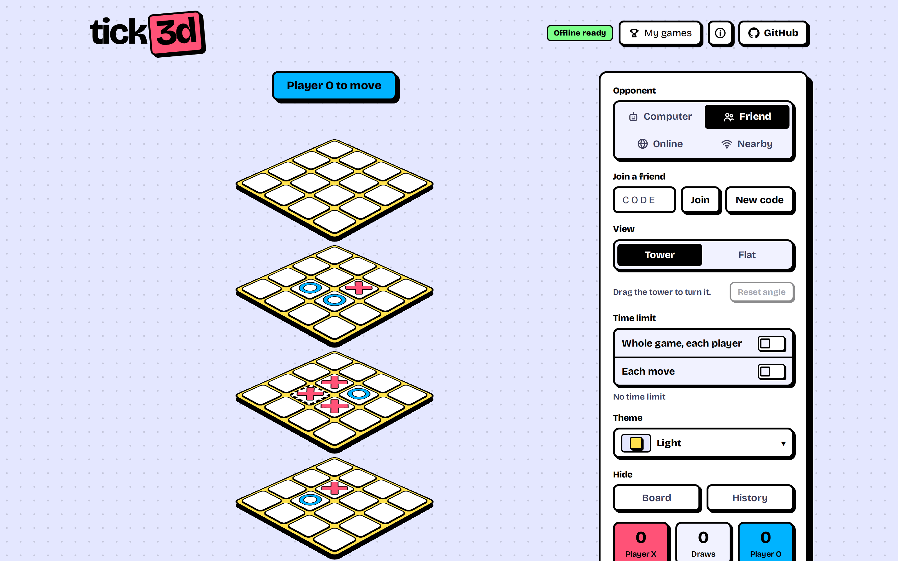
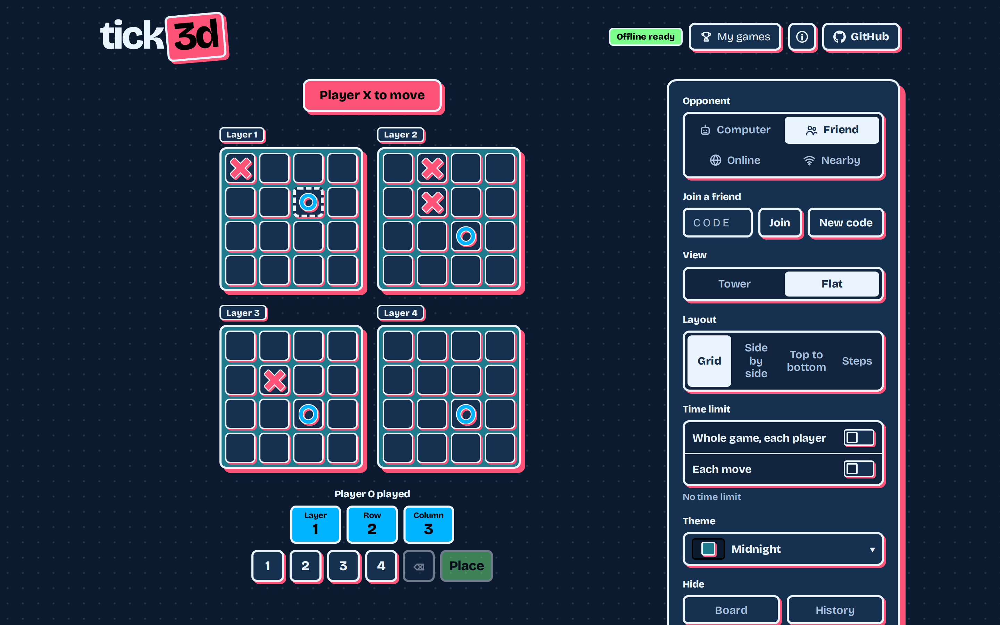
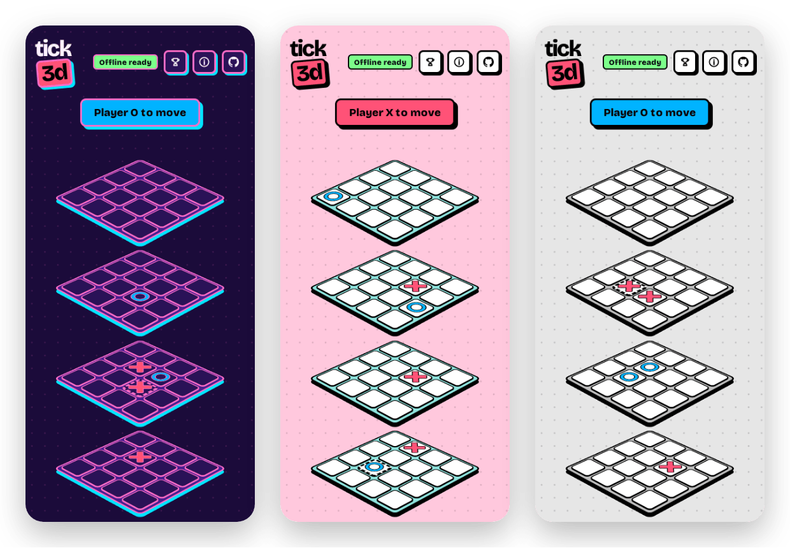
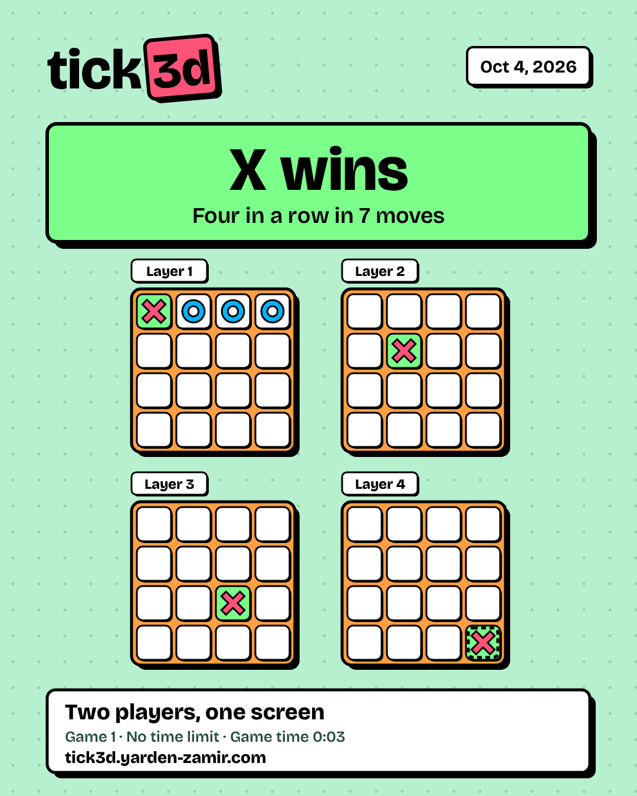
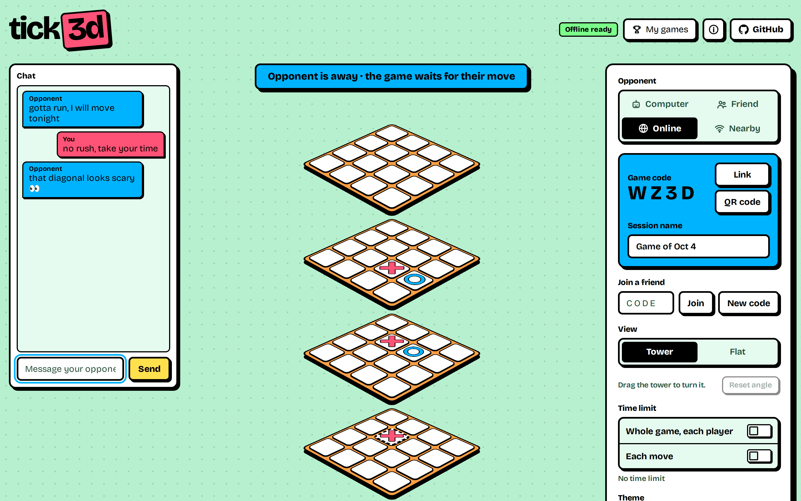
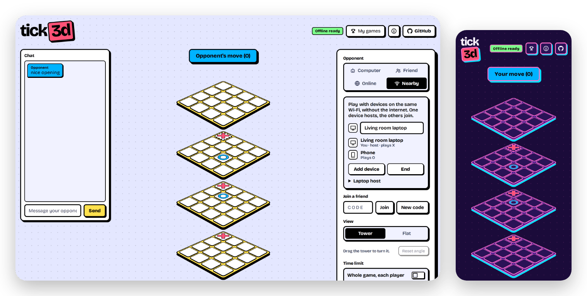
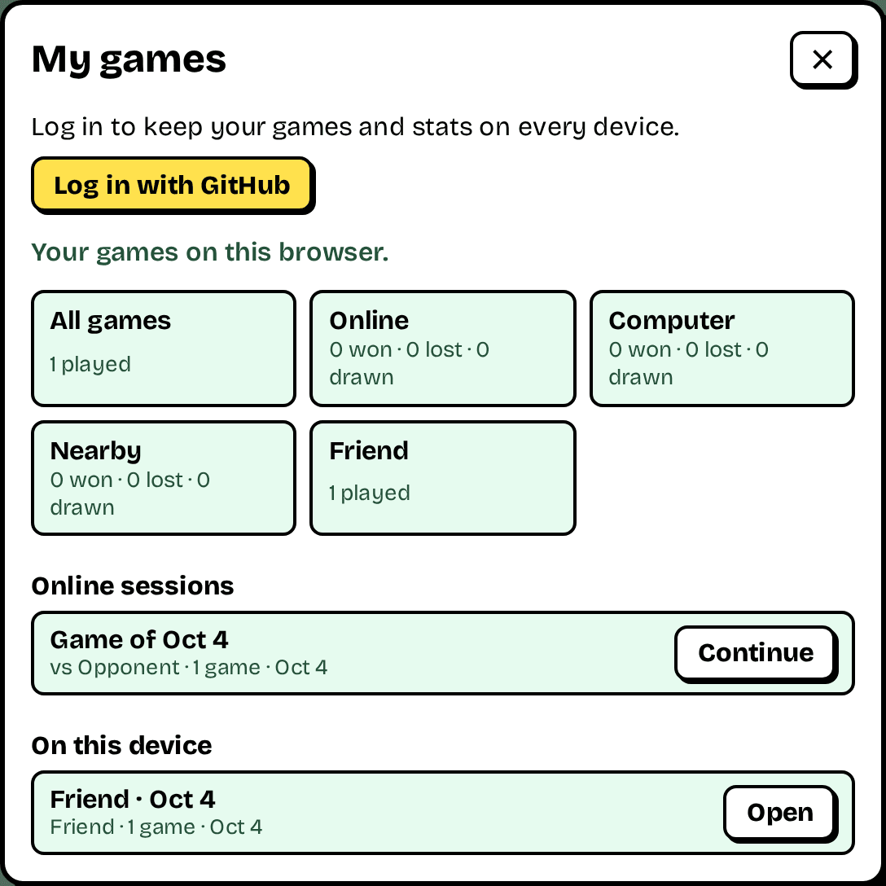

# tick3d

3D tic-tac-toe on a 4×4×4 cube, at [tick3d.yarden-zamir.com](https://tick3d.yarden-zamir.com).
It replaces the Lovable version at [3tees.yarden-zamir.com](https://3tees.yarden-zamir.com) ([voice-quad-checkers-arena](https://github.com/Yarden-zamir/voice-quad-checkers-arena)).



## Rules

- Two players take turns. X moves first.
- Four marks in a straight line win. There are 76 lines: 48 along an axis, 24 diagonals inside a plane, and 4 through the cube.
- A full cube with no line is a draw.

## Features

- Play against the computer, a friend on the same device, a friend online, or devices on the same Wi-Fi with Nearby.
- The computer has three levels. Each level plays a different game each time: the first move goes to a random strong cell, and later choices are weighted by how good a cell is, not fixed. A strong cell is one of the 8 corners or the 8 inner cells, which each sit on 7 lines.
  - Easy: takes a win when it sees one. It blocks your win a bit more than half the time early in a game, and cares more about its own lines than yours, so it leaves openings.
  - Medium: takes a win and always blocks your win early in a game. Sometimes it makes a double threat (two winning cells at once), or takes the cell where you could make one. Otherwise it picks one of its best cells by weight.
  - Hard: takes a win and blocks your win. It looks for a win by threats in a row, and avoids a move that gives you one. Otherwise it searches ahead with alpha-beta pruning for up to 600 ms and picks among the moves that score about the same as the best.
  - Easy and medium tire in a long game, like a person under more and more load. From a set move on, they block less often, see fewer double threats, and choose more randomly. A missed block means that the computer did not see your threat at all. Medium starts to tire at move 20 and is fully tired at move 60, when it blocks 85% of the time. Hard does not tire.
- Advanced settings: in computer mode, "Advanced: computer player" at the bottom of the panel lists every number behind the computer, for each level. Easy and medium have a fresh and a tired value for each chance and for the randomness, and the moves where tiring starts and ends. Hard has its thinking time, search width, threat depth and equal-move margin. A change applies from the next computer move, and "Reset to defaults" restores the tested values. A lock also locks these settings. A changed computer keeps its own survival records, and its end card says "(tuned)".
- Move validation: an occupied cell, a move after the game ends, a move out of turn, or a move by a spectator is refused with a sound and a message. Every mode runs the same session rules (`src/session/core.ts`): the server for online games, the device for computer and friend games, the host's device for Nearby games.
- Hide the board, or hide all marks except the last move. Play by coordinates: tap the layer, row and column on the 1 to 4 keypad, for example `2 3 4`. The target cell is outlined before you place. Until you tap a number, the keypad shows the coordinates of the last move, yours or the other player's, so you can follow the game with the board hidden. Hidden marks show again when the game ends.
- Lock settings: after a lock, no setting (the view included) changes until the game ends. The session keeps the lock, so a reload does not end it. With another device, either player can lock, and the lock holds for both players.
- Session history: the panel lists the games of the session. Replay steps through a finished game move by move. A session holds any number of games.
- Time limits, like a chess clock: a limit per player for the whole game (30 s to 120 min), a limit per move (3 s to 10 min), or both. Each limit has a switch, a number box and quick picks. A player who runs out of either limit loses. The first move of each player is untimed, so the clock starts after both players moved once. A clock ticks in the last 10 seconds. A timed game has no undo.
- A game keeps the time limit it started with. A change during a game starts with the next game, and the panel shows both limits until then.
- End card: at the end of a game, a card shows the result, the final board and the game details, the hide settings included. New game on the card starts the next game. The card uses the active theme. Share sends the image through the system share sheet. Without file sharing (most desktop browsers), Share copies the image, and Save image downloads it. Two check boxes, both on by default, add the game code and the link to the card and the share text. A local game has no code, so it shows only the link option.
- Survival records: when the computer wins, the number of moves that the game lasted can be a new record. Each level, time limit and hide setting keeps its own record. A new record shows as a message and as a sticker on the end card, with the old best. The first loss of a setup sets the record without a message. The records stay on the device.
- Sound effects made with Web Audio. Each layer has its own note. A mute button keeps the choice.
- Drag the tower sideways to turn it all the way round. The tilt stays at the resting view. On a touch screen, a vertical swipe still scrolls the page. Reset angle returns to the resting view, and the browser keeps the angle. A drag never places a mark. Boards and tiles have real 3D depth in the tower, so they look solid at any turn. Layer 1 is the bottom plane and layer 4 the top one; the flat view labels each layer.
- Two views: a 3D tower of tilted layers and a flat view. The flat view has four layouts: grid, side by side, top to bottom, and steps.
- Twelve neo-brutalist themes in a folding menu in the panel: Light (the default), Dark, Snow, Candy, Mint, Retro, Midnight, Synthwave, Bloodmoon, Dark coffee, Batman (dark, no color) and Mono. Like the mute button, the theme stays open during a lock.
- Point at a cell to light up the cells above and below it.
- A GitHub button in the header links to this repository.
- The browser keeps the settings in `localStorage`. The app checks each stored value and uses the default for a value that is not valid.







## Online play

- Choose Online to create a session. The page shows a 4 character code and puts it in the link (`?code=AB3K`). Link sends the link, or copies it when the device cannot share. QR code shows the link as a QR code, which a phone camera opens directly.
- Codes use letters and digits without `0`, `O`, `1` and `I`, so a code read aloud is not ambiguous.
- The creator plays X. The first other browser that opens the code plays O. Further browsers watch.
- A browser keeps its seat through a random token in `localStorage`.
- A link with a code that opens no game (no game with that code, or no network for a new game) shows the error, drops the code from the address, and starts the page as usual.
- A code loads the full session, finished games included. Either player can name the session and start the next game after a game ends.
- Chat: on a wide screen a column at the left, on a narrower one a box under the board. It sends messages to the other player in real time, online and over Nearby. Only the two players can write, watchers read along. A session keeps its newest 50 messages of up to 200 characters.
- Hide board and Hide history belong to the session. A change by either player applies to both players and to watchers. View and layout stay per screen.
- The time limit also belongs to the session. A new session takes the time limit of the screen that creates it. Either player can change it at any time, except during a lock. The change reaches both players and starts with the next game. The server records the move times and decides a timeout, so a page that closes cannot avoid a loss on time.
- A session never expires, so the same two players can keep playing for as long as they like. After the first join, a player can leave and come back later: the game waits for their move. The other player sees them as away (a dimmed score tile and "is away" in the status), so a game can also run asynchronously. A clock keeps running while a player is away.
- There is no limit on sessions or on games per session. Add one when storage use calls for it.



## Offline play

- After the first visit, the game opens without a network: a service worker keeps the page, the fonts and the icons. "Offline ready" shows in the header, and the game is installable on a phone.
- Computer and friend games run on the device and are stored in its IndexedDB. Every session stays on the device, with no limit. A reload or a restart continues the game.
- An online game this device saw before opens read-only without a network, as last seen.
- When a computer, friend or Nearby game ends and the network is up, the device sends the result to the server. Results from games played offline go along with it. A result has an id from the device, so the server stores it once.
- After a deploy, a returning player sees "A new version of tick3d is ready" with a Reload button. The page never reloads by itself in the middle of a game.
- Safari deletes the stored data of a site that the player does not open for 7 days. A game added to the home screen keeps its data.

## Nearby

- Choose Nearby to play with devices on the same Wi-Fi, without the internet. One device hosts, the others join.
- The host shows a QR code. The guest scans it with the phone's own camera, which opens the game, and shows its own code, which the host scans the same way. On the host, the answer opens in a new tab that hands the code to the hosting tab. Each code also has a text form to copy and paste, for a device without a camera.
- The devices then talk directly over WebRTC. The host's device holds the session and checks every move with the same rules as the server, so a guest can never move for the host.
- The panel lists the connected devices with an icon for each kind: phone, tablet or computer. The first guest plays O, later guests watch.
- The host's screen stays on while it hosts. When the host ends the game or closes the page, the guests see a message.
- Chat, the lock, the hide options and time limits work as in an online game.
- Host on a laptop: `docker compose -f compose.lan.yml up --build` runs the full game server on a computer. Others on the same network open `http://<that computer's address>:8080` and play the Online mode, with no codes to scan. The online box shows the host with a server icon. Without HTTPS, a browser gives that page no offline cache and no camera; the game itself works. Set `LAN_HOST_NAME` for the name it shows, and `LAN_PORT` when port 8080 is taken.



## Accounts and My games

- Login with GitHub is optional. Every browser plays with a random token either way.
- A login links the browser's token to the GitHub account. Sessions then follow the player: a seat taken on a laptop also plays from a phone that logged in to the same account, so an async game can continue on another device.
- The score shows a player's GitHub name and avatar, and the chat uses the name.
- My games (the button in the header) shows the account, stats per mode and per computer level, the online sessions with a "Your turn" mark and a Continue button, and every session on this device. Offline, it shows the games on this device.
- The login runs on the production address. Its cookie is signed and valid for `tick3d.yarden-zamir.com` and its subdomains, so pull request previews see it too. Without the GitHub settings, login is off and the page hides it.



## Code

- `src/game.ts`: board, lines, move validation, win and draw detection, undo.
- `src/ai.ts`: the three computer levels.
- `src/sound.ts`: synthesized sounds.
- `src/clock.ts`: time limits and the time left for each player.
- `src/card.ts`: draws the end card on a canvas and shares it.
- `src/protocol.ts`: the contract between the page and the API (code format, names, results, response checks).
- `src/session/core.ts`: the session rules as pure functions. `src/session/format.ts`: the stored session format and its upgrades.
- `src/online.ts`: the API client and the live update stream. `src/local.ts` and `src/device-db.ts`: the device backend on IndexedDB.
- `src/nearby/`: WebRTC connections, QR codes, the messages between host and guests, device kinds, and the host and guest sessions.
- `src/pwa.ts` and `vite.config.ts`: the service worker and the manifest.
- `src/main.ts`, `src/style.css`, `index.html`: the page.
- `public/`: the favicons and touch icons, copied into the build as is. The service worker plugin writes the web manifest.
- `server/main.ts`: the HTTP API and server-sent events. `server/store.ts`: the DuckDB store. `server/auth.ts`: GitHub login.

The page is plain TypeScript built with Vite, with no runtime dependencies. The API runs on Node 24, which runs TypeScript directly, and stores sessions in [DuckDB](https://duckdb.org) through `@duckdb/node-api`.

## Stored data and format changes

- The `sessions` table has one row per session: the code, a creation order, a version, timestamps, and the session as one `VARIANT` document. `users` and `player_tokens` link browsers to GitHub accounts. `results` holds finished games that devices sent.
- A device stores its sessions in the same document format in IndexedDB, so the same rules read and upgrade them on a phone.
- The document carries a `format` number. `src/session/format.ts` reads every known format, upgrades old documents step by step, and writes the current format back on the first read.
- A new optional field needs only a default in `parseDoc`. A breaking change needs a new `CURRENT_FORMAT` and one `UPGRADES` step. Neither needs a database reset or a manual migration.
- A server refuses a document from a newer format, so an older server version never overwrites newer data.
- Every write goes through the same check as every read, so the table never holds a document that cannot be read back.
- `src/session/fixtures/` holds a stored document of each released format. A test reads each one, so old data keeps working.
- Table changes are append-only statements such as `ALTER TABLE sessions ADD COLUMN IF NOT EXISTS`, which run on every start.

## Develop

Node is not necessary on the host. Run the commands in a container:

```sh
docker run --rm -v "$PWD":/app -w /app node:24-alpine sh -c 'npm ci && npm run check && npm run build'
docker run --rm -it -p 5173:5173 -v "$PWD":/app -w /app node:24-alpine npx vite --host
```

`npm run check` runs the type check, every linter and the tests. `npm run build` runs the type check (`tsc`) before the Vite build. `npm run api` starts the API on port 8080 with `./dev.duckdb`.

`npm run lint` runs these checks. Each one catches faults that the type check does not:

- [oxlint](https://oxc.rs) with type-aware rules (`.oxlintrc.json`). It runs on the TypeScript 7 checker through `oxlint-tsgolint`. typescript-eslint does not support TypeScript 7. The rules catch promises that nobody awaits or catches, promises passed where a function must return nothing, switches that miss a case, and needless type assertions. Style rules are off.
- [stylelint](https://stylelint.io) with `stylelint-config-recommended` (`.stylelintrc.json`): unknown properties, invalid values and duplicate selectors in the CSS. No style rules.
- [html-validate](https://html-validate.org) (`.htmlvalidate.json`): invalid markup and accessibility faults in `index.html`, such as a button without a name or an input without a type.
- [Knip](https://knip.dev): files, exports and packages that nothing uses.

`npm run e2e` runs the Playwright tests in `e2e/` against a deployed site in Chromium. Set `E2E_BASE_URL` to the site, for example a pull request preview. Without it, the run stops at once. Run the tests in the Playwright image:

```sh
docker run --rm --ipc=host -v "$PWD":/app -w /app -e E2E_BASE_URL=https://pr.17.tick3d.yarden-zamir.com mcr.microsoft.com/playwright:v1.63.0-noble sh -c 'npm ci && npm run e2e'
```

- The image tag must match the `@playwright/test` version in `package.json`. Update both together.
- `npm ci` in the Playwright image installs packages for glibc. Run `npm ci` again before you use `node:24-alpine`.
- Each test opens fresh browser contexts, and the tests run in parallel. The HTML report goes to `e2e/playwright-report/`. A failed test keeps a trace in `e2e/test-results/`.
- One run creates 6 online sessions. The server allows 60 new sessions per hour from one address.
- The `e2e` workflow runs the suite after a successful pull request preview deploy. When a test fails, the workflow uploads the HTML report.
- Knip finds the tests through its `entry` setting in `package.json`. Its Playwright plugin is off, because the plugin loads the config, and the config stops without `E2E_BASE_URL`.
- The laptop host (`compose.lan.yml`) has no automatic test. It needs a local Docker host and a second device on the network.

## Deploy

See [kitshn.md](kitshn.md). A push to `main` deploys production.
